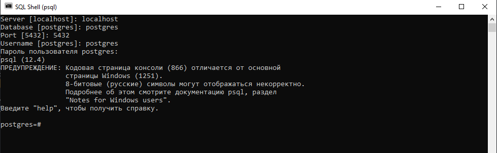

# learn postgres

### First Steps : Notes

**Warning 1** Be careful after you downloaded the postgreSQL and puted your `password` and default `port` (5432). You must open `pgAdmin 4`. At windows 10 he is in left part of the search. Poti numi cum vrei dedavneie prilojenie, vse prilojenie sau chiar In other words, where you turn off the computer.

**Warning 2** if can't install PostgreSQL, see at video "How to Install PostgreSQL & pgAdmin 4 on Windows 10" [YouTube](https://www.youtube.com/watch?v=e1MwsT5FJRQ&list=PLQqEY2kzSbZ5m0FyWH0BuOiCne05mwecW&index=6&ab_channel=ProgrammingKnowledge)

### Second Step : Install Postgres

1. You can install PostgreSQ with `scoop` or you can go [official site](https://www.postgresql.org/download/). 

2. Memoreaza port and password

3. check `postgres --version` in powershell.

4. Add Path: Переменые оружение

5. Pentru a face primele cereri trebuie sa folosesti SQL Shell (PSQL). Se afla in meniul search acolo unde este aplasata si pgAdmin 4.

6. fa asa cum vezi pe desenenul mai jos.

 

### Work with PostgreSQL

1. install postgres: `scoop install postgresql`

2. start server: `pg_ctl start`  (Additionally)

3. stop server: `pg_ctl stop` (Additionally)

4. connect at Postgres from console or terminal `psql -U postgres`

5. see all db: `\l`

6. create database: `CREATE DATABASE name_db`

7. create a new table:
`CREATE TABLE name_table(id INT PRIMARY KEY, name text, age INT);`

8. select db: `\c name_db`

9. see tables: `\dt`

10. rename table: `alter table old_name rename to new_name;`

11. clear postgres console:`\! cls;`

12. see content the table: `select * from name_table;`

13. put inside to the table: 
`insert into users values(2, 'Vasea', 21);`

14. see container table:
`select * from name_table where id=5;`

15. see container table: `select * from name_table where id=5`;

16. add a column; schimba coloana; <!>
`UPDATE name_table SET name_column= 34 WHERE id = 1;`

17. adauga new coloana ca: id, name, age. <!>
`ALTER TABLE name_table ADD COLUMN new_column  INT; `

18. poti sa schimbi numele coloanei intr-un tabel.
`???`

19. change name at the column:
`alter table name_table rename column_name to new_column;`

20. describe table: `\d name`

21. leave db: `\q`

22. delete/drop databse `DROP DATABASE the_name_to_db`